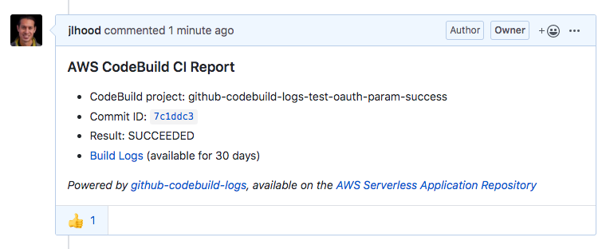

# aws-codebuild-github-autobuild
aws-codebuild-github-autobuild utilizes the AutoBuild feature from the aws-delivlib library (https://github.com/awslabs/aws-delivlib).

An easy way to trigger AWS CodeBuild through any changes from a GitHub repository.


# Credential Variables
## Option 1: Specify context variables as part of the AWS CDK CLI command 
1. Run `npm run build` to perform the necessary build tasks for the project

2. Replace `PLACEHOLDER` with a valid GitHub repository, GitHub Token Secrets Manager ARN, and name/path to the buildspec file.
    
    ```$ cdk deploy --context github_repo=PLACEHOLDER --context github_token=PLACEHOLDER --context buildspec=PLACEHOLDER```

3. Run this command in the terminal when deploying your stack.

## Option 2: Exporting Variables  

1. In main stack, make sure to include: 
```
import {github_repo, github_token, buildspec} from '../credentials';
```

2. Remove these lines of code in main stack since we are exporting variables.
```
const github_repo:string = this.node.tryGetContext('github_repo');
const github_token:string = this.node.tryGetContext('tokenSecretArn');
const buildspec = BuildSpec.fromObject(yaml.parse(fs.readFileSync(this.node.tryGetContext('buildspec'), 'utf8')));
```
      
3. In your root directory, create a file called `credentials.ts`

4. The `credentials.ts` should look like:
    ### BuildSpec file in repository   
    ```
    export var github_repo:string = 'PLACEHOLDER';
    export var github_token:string = 'PLACEHOLDER';
    export var buildspec:string = 'PLACEHOLDER'
    ```    
    * In `lib/github-codebuild-stack.ts`, change the buildspec line to:
        ```
        buildSpec: BuildSpec.fromSourceFilename(buildspec)
        ```

    ## OR

    ### Inline BuildSpec object in Codebuild
    ```
    import { BuildSpec } from "monocdk-experiment/src/aws-codebuild";

    export var github_repo:string = 'PLACEHOLDER';
    export var github_token:string = 'PLACEHOLDER';

    // REPLACE WITH YOUR BUILDSPEC CONTEXT
    export var buildspec = BuildSpec.fromObject({
        version: '0.2',
        phases: {
        build: {
            commands: [
            'echo "Hello, world!"'
            ]
        }
        },
        artifacts: {
        files: [ '**/*' ],
        'base-directory': 'dist'
        }
    });
    ```

5. Replace `PLACEHOLDER` with a valid GitHub repository, GitHub Token Secrets Manager ARN, and name/path to the buildspec file OR buildspec context.


# CloudFormation Stack
If you did Option 1 in the Credential Variables section, ignore these steps:
1. Run `cdk synth` to emit the synthesized 
    * If you receive a `Subprocess exited with error 1`. Try deleting `node_modules` and running `npm i` in root directory.

2. Run `cdk deploy` to deploy this stack to your AWS account
3. If successful, the stack will be created in the configured AWS account with the specified GitHub repository
4. Any changes to the repository (pull requests or pushes) will trigger the CodeBuild
5. The specified buildspec in the repository will be ran

One build file will be ran in the AutoBuild. If there are multiple build files, you may need to create one build file with all the builds combined. 

# (Optional) GitHub CodeBuild Logs
Reference: https://serverlessrepo.aws.amazon.com/applications/arn:aws:serverlessrepo:us-east-1:277187709615:applications~github-codebuild-logs

This serverless app solves a common complaint when using AWS CodeBuild as a CI solution: PR contributors don't have access to the build logs if the CI build fails on their PR branch. The app creates publicly accessible links to PR build logs for a given AWS CodeBuild project and posts them as a comment on the corresponding GitHub PR.




To attach this app to an existing AWS CodeBuild project in your AWS account,

1. Go to the app's page on the [Serverless Application Repository](https://serverlessrepo.aws.amazon.com/applications/arn:aws:serverlessrepo:us-east-1:277187709615:applications~github-codebuild-logs) and click "Deploy"
2. Provide the CodeBuild project name and any other parameters (see parameter details below) and click "Deploy"

## App Parameters
1. CodeBuildProjectName (required) - Name of CodeBuild project this app is posting logs for.
2. ExpirationInDays (optional) - Number of days before a build's log page expires. Default: 30
3. CodeBuildProjectCustomLogGroupName (optional) - If the CodeBuild Project has a custom log group name, you can specify it here. If not provided, the app will assume the CodeBuild default log group name format of /aws/codebuild/<project name>.
4. GitHubOAuthToken (optional) - OAuth token used for writing comments to GitHub PRs. If not provided, the app will attempt to pull an OAuth token from the CodeBuild project. Note, if your CodeBuild project does not have a GitHub OAuth token, e.g., it is being used to build a public GitHub repo, then this parameter will be required for the app to function properly.
NOTE: The access token used requires public_repo permissions for public repositories or repo for private repositories.
5. DeletePreviousComments (optional) - Set to true to delete previously posted PR comments before posting a new one. Default: false
6. LogLevel (optional) - Log level for Lambda function logging, e.g., ERROR, INFO, DEBUG, etc. Default: INFO
7. CommentOnSuccess (optional) - Set to false to not publish a comment when build is successful. Default: true
