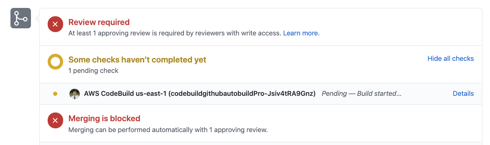

# aws-codebuild-github-autobuild
aws-codebuild-github-autobuild utilizes the AutoBuild feature from the aws-delivlib library (https://github.com/awslabs/aws-delivlib).

An easy way to trigger AWS CodeBuild through any changes from a GitHub repository.

# CodeBuild CLI Repository Credentials Set Up
Imports the source repository credentials for an AWS CodeBuild project that has its source code stored in a GitHub or GitHub Enterprise repository.

1. On your terminal, check if there is a valid GitHub token stored for an AWS CodeBuild project

    ```
    $ aws codebuild list-source-credentials
    ```

    ## Output 

    No Token Set Up:
    ```
    {
        "sourceCredentialsInfos": []
    }
    ```

    Pre-configured Token:
    ```
    {
        "sourceCredentialsInfos": [
            {
                "arn": "XXXXXXXXXXX",
                "serverType": "GITHUB",
                "authType": "PERSONAL_ACCESS_TOKEN"
            }
        ]
    }
    ```
    **You may not have more than one token of the same authType. Make sure it is the correct token for the repository.**

    To delete the token shown, you could run `aws codebuild delete-source-credentials --arn <arn>`

    *If you have a valid token, you may skip the rest of the set up in this section.*

2. To connect to GitHub, you will need to create [Personal GitHub Access Token](https://github.com/settings/tokens) and store it in the token parameter of this command.

    For GitHub, your personal access token must have the following scopes:
    * public_repo: Grants access to public repositories
    * repo:status: Grants access to commit statuses
    * admin:repo_hook: Grants full control of repository hooks 

    ```
    $ aws codebuild import-source-credentials --server-type GITHUB --auth-type PERSONAL_ACCESS_TOKEN --token <value>
    ```

    If successful, it will output:

    ```
    {
        "arn": "XXXXXXXXXXXXXXXXXXXXXXXXX"
    }
    ```

    You have successfully set up the source repository credentials for an AWS CodeBuild project.

3. Store the created Personal GitHub token in Secrets Manager for the next section.


# Context Variables
Specify context variables as part of the AWS CDK CLI command 

0. Run `npm install` to install dependencies.

1. Run `npm run build` to perform the necessary build tasks for the project


2. Replace `PLACEHOLDER` with:
    * GitHub repository path
    * Secrets Manager ARN of the GitHub token (Step 3 of *CodeBuild CLI Repository Credentials Set Up*)
        * OAuth token is used for writing comments to GitHub PRs
    * Name/path of buildspec file in this repository 
    ```
    $ cdk deploy --context github_repo=PLACEHOLDER --context github_token=PLACEHOLDER --context buildspec=PLACEHOLDER
    ```

3. Run this command in the terminal when deploying your stack. This will create a new CodeBuild project with the Autobuild feature.
    * If you receive a `Subprocess exited with error 1`. Try deleting `node_modules` and re-installing using `npm i`

4. Any changes to the repository (pull requests or pushes) will trigger the CodeBuild. GitHub CodeBuild Logs will be automatically commented in the repository once the CodeBuild finishes running. *More details in the next section.*


One build file will be ran in the AutoBuild. If there are multiple build files, you may need to create one build file with all the builds combined. 

# GitHub CodeBuild Logs
Reference: https://serverlessrepo.aws.amazon.com/applications/arn:aws:serverlessrepo:us-east-1:277187709615:applications~github-codebuild-logs

This serverless app solves a common complaint when using AWS CodeBuild as a CI solution: PR contributors don't have access to the build logs if the CI build fails on their PR branch. The app creates publicly accessible links to PR build logs for a given AWS CodeBuild project and posts them as a comment on the corresponding GitHub PR.


This is automatically attached to the created AWS CodeBuild project in your AWS account
  
# Required Reviews from Code Owners (Optional)
Reference: https://docs.github.com/en/github/administering-a-repository/enabling-required-reviews-for-pull-requests



1. On GitHub, navigate to the main page of the repository.
2. Under your repository name, click  Settings.
3. In the left menu, click Branches.
4. Next to "Branch protection rules", click Add rule.
5. Under "Branch name pattern", type the branch name or pattern you want to protect.
6. Select Require pull request reviews before merging.
7. In the Required approving reviews drop-down menu, select the number of approving reviews you'd like to require on the branch.
8. Enable require review from Code Owners to require review from a code owner when the pull request affects code that has a designated owner. For more information, see ["About code owners](https://docs.github.com/en/github/creating-cloning-and-archiving-repositories/about-code-owners)."

## Create CODEOWNERS file
CODEOWNERS file location
To use a CODEOWNERS file, create a new file called CODEOWNERS in the root, docs/, or .github/ directory of the repository, in the branch where you'd like to add the code owners.

Each CODEOWNERS file assigns the code owners for a single branch in the repository. Thus, you can assign different code owners for different branches, such as @octo-org/codeowners-team for a code base on the master branch and @octocat for a GitHub Pages site on the gh-pages branch.

For code owners to receive review requests, the CODEOWNERS file must be on the base branch of the pull request. For example, if you assign @octocat as the code owner for .js files on the gh-pages branch of your repository, @octocat will receive review requests when a pull request with changes to .js files is opened between the head branch and gh-pages.

Example of CODEOWNERS file:
```
# This is a comment.
# Each line is a file pattern followed by one or more owners.

# These owners will be the default owners for everything in
# the repo. Unless a later match takes precedence,
# @global-owner1 and @global-owner2 will be requested for
# review when someone opens a pull request.

*       @global-owner1 @global-owner2

# Order is important; the last matching pattern takes the most
# precedence. When someone opens a pull request that only
# modifies JS files, only @js-owner and not the global
# owner(s) will be requested for a review.

*.js    @js-owner

# You can also use email addresses if you prefer. They'll be
# used to look up users just like we do for commit author
# emails.

*.go docs@example.com

# In this example, @doctocat owns any files in the build/logs
# directory at the root of the repository and any of its
# subdirectories.

/build/logs/ @doctocat

# The `docs/*` pattern will match files like
# `docs/getting-started.md` but not further nested files like
# `docs/build-app/troubleshooting.md`.

docs/*  docs@example.com

# In this example, @octocat owns any file in an apps directory
# anywhere in your repository.

apps/ @octocat

# In this example, @doctocat owns any file in the `/docs`
# directory in the root of your repository.

/docs/ @doctocat
```